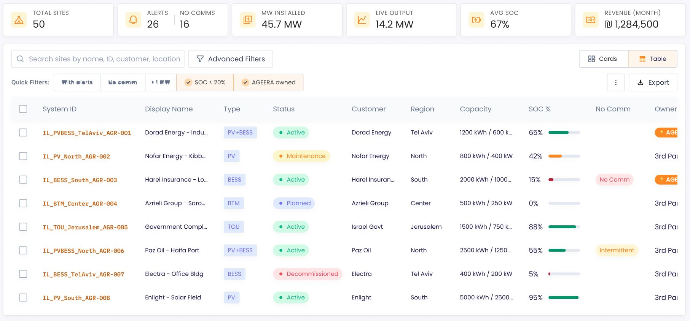

# Frontend Interview Task — Energy Management Dashboard

## Overview

Build a responsive **Energy Management Dashboard** in React that resembles the design shown in `dashboard.JPG`. The mock data is provided in `src/mockData.js`.

---

## Design Reference



---

## Getting Started

The React app is pre-scaffolded with Vite. Just install dependencies and start:

```bash
npm install
npm run dev
```

The app will be available at `http://localhost:5173`.

`mockData.js` is already in `src/` — no setup needed.

No specific UI library is required — you may use one or build custom components.

---

## Task Requirements

### 1. Stats Bar

Display the following KPI cards at the top of the page using `dashboardStats` from `mockData.js`:

| Stat            | Value       |
| --------------- | ----------- |
| Total Sites     | 50          |
| Alerts          | 26          |
| No Comms        | 16          |
| MW Installed    | 45.7 MW     |
| Live Output     | 14.2 MW     |
| Avg SOC         | 67%         |
| Revenue (Month) | ₪ 1,284,500 |

---

### 2. Sites Table

Render the `sites` array as a data table with the following columns:

- **System ID** — styled as a link/monospace identifier
- **Display Name** — truncated if too long
- **Type** — badge chip (PV, BESS, PV+BESS, BTM, TOU)
- **Status** — colored dot + label (Active = green, Maintenance = yellow, Planned = blue, Decommissioned = red)
- **Customer**
- **Region**
- **Capacity** — formatted as `{capacityKwh} kWh / {capacityKw} kW`
- **SOC %** — percentage value with a progress bar; color the bar based on level (e.g., red < 20%, orange 20–50%, green > 50%)
- **No Comm** — badge shown only when `commStatus` is `"No Comm"` or `"Intermittent"`
- **Owner** — badge, highlighted differently for `"AGEERA"` vs `"3rd Party"`

Include a **checkbox column** for row selection (select all + individual rows).

---

### 3. Search

Add a text input that **filters the table in real time** across:

- `displayName`
- `id`
- `customer`
- `region`

---

### 4. Quick Filters

Implement the following one-click toggle filters (multiple can be active simultaneously):

| Label        | Logic                      |
| ------------ | -------------------------- |
| With alerts  | `hasAlert === true`        |
| No comm      | `commStatus === "No Comm"` |
| > 1 MW       | `capacityKw > 1000`        |
| SOC < 20%    | `socPercent < 20`          |
| AGEERA owned | `owner === "AGEERA"`       |

---

## Evaluation Criteria

| Area                 | What we look for                                        |
| -------------------- | ------------------------------------------------------- |
| **Component design** | Sensible decomposition, reusable pieces                 |
| **State management** | Clean handling of filters, search, selection            |
| **Rendering**        | Correct data display, edge cases (0%, No Comm, Planned) |
| **UI fidelity**      | Reasonable match to the reference screenshot            |
| **Code quality**     | Readable, consistent, no unnecessary complexity         |

---

## Deliverables

- Source code (zip or Git repo link)
- Brief note on any decisions or trade-offs you made

---

## Data Reference

All mock data is exported from `src/mockData.js`:

```js
import {
  dashboardStats,
  sites,
  SITE_TYPES,
  SITE_STATUSES,
  REGIONS,
  OWNERS,
  COMM_STATUSES,
} from "./mockData.js";
```

**Site object shape:**

```ts
{
  id: string; // e.g. "IL_PVBESS_TelAviv_AGR-001"
  displayName: string;
  type: string; // "PV" | "BESS" | "PV+BESS" | "BTM" | "TOU"
  status: string; // "Active" | "Maintenance" | "Planned" | "Decommissioned"
  customer: string;
  region: string; // "Tel Aviv" | "North" | "South" | "Center" | "Jerusalem"
  capacityKwh: number;
  capacityKw: number;
  socPercent: number; // 0–100
  commStatus: string; // "OK" | "No Comm" | "Intermittent"
  owner: string; // "AGEERA" | "3rd Party"
  hasAlert: boolean;
}
```
